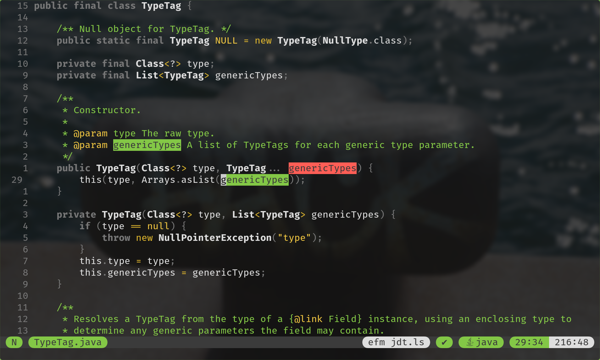
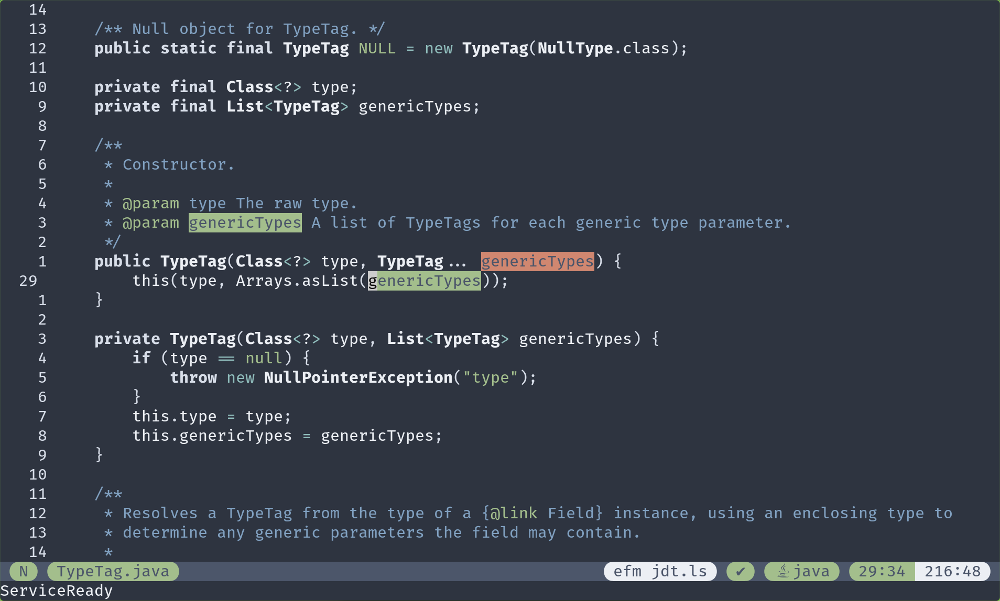
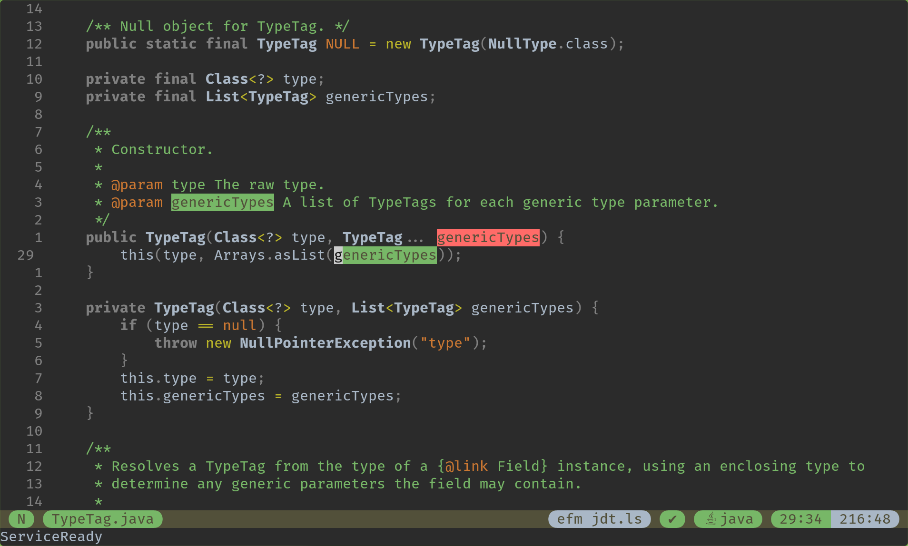
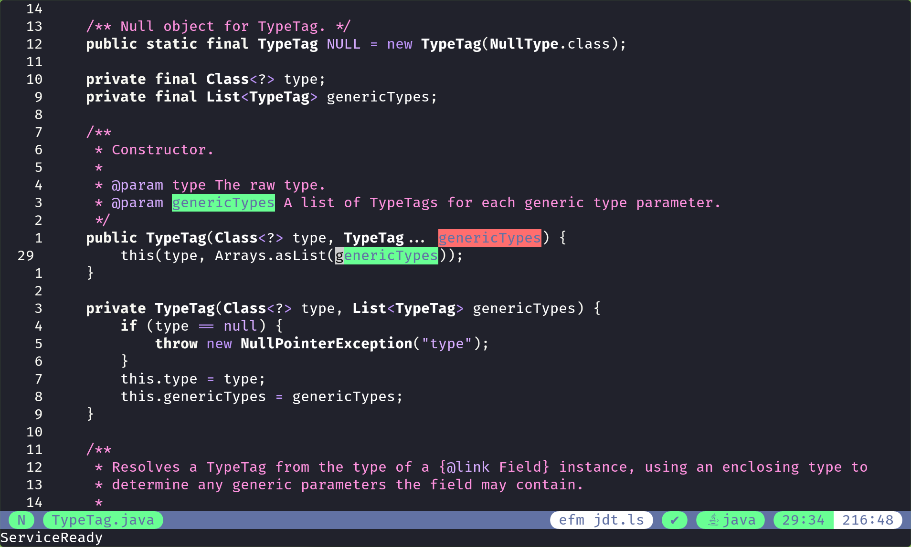

# Tranquility.nvim

A quiet colorscheme for Neovim.

## Philosophy

I find that most color schemes emphasize the reserved words in a language by giving them bright colours. Tranquility.nvim does the opposite, and emphasizes identifiers instead. After all, that’s what the code is really about, right?

It provides a collection of colorschemes derived from different well-known palettes, because sometimes it's nice to mix things up, without sacrificing any principles.

## Screenshots


Green tranquility: based on [Selenized palette](https://github.com/jan-warchol/selenized)


Nordic Tranquility: based on [Nord palette](https://www.nordtheme.com/)


TranquiliJ IDEA: based on [IntelliJ IDEA palette](https://www.jetbrains.com/idea/)


Tranquil Dracula: based on [Dracula palette](https://draculatheme.com/)

## Configuration

Install the plugin with your favorite plugin manager, for instance:

```vim
Plug 'jqno/tranquility.nvim'
```

Set your colorscheme; pick one:

```vim
colorscheme tranquility
colorscheme green-tranquility
colorscheme nordic-tranquility
colorscheme tranquilij-idea
colorscheme tranquil-dracula
```

## Advanced configuration

The colorscheme can further be configured through the `vim.g.tranquility_overrides` variable:

```lua
-- Each of the keys in this table is optional:
vim.g.tranquility_overrides = {
    palette = {
        -- Each color is a pair of hex value and terminal color code
        dark_black = { '#252525', '235' },
        light_black = { '#3b3b3b', '237' },
        dark_red = { '#ed4a46', '204' },
        light_red = { '#ff5e56', '203' },
        dark_green = { '#70b433', '107' },
        light_green = { '#83c746', '113' },
        dark_yellow = { '#dbb32d', '179' },
        light_yellow = { '#efc541', '221' },
        dark_blue = { '#368aeb', '69' },
        light_blue = { '#4f9cfe', '75' },
        dark_magenta = { '#eb6eb7', '205' },
        light_magenta = { '#ff81ca', '212' },
        dark_cyan = { '#3fc5b7', '79' },
        light_cyan = { '#56d8c9', '80' },
        dark_white = { '#777777', '243' },
        light_white = { '#dedede', '253' }
    },
    mappings = {
        -- Each mapping refers to one of the colors above
        comment = 'light_green',
        literal = 'light_yellow',
        operator = 'dark_yellow',
        ui = 'light_blue',
        error = 'light_red',
        warning = 'light_magenta',
        info = 'light_white',
        hint = 'light_cyan'
    },
    -- Whether or not the background should be transparent
    transparent_background = true
    -- With certain statusline plugins, sometimes it just looks better with inverted colors
    invert_statusline = true
}
```

## Inspiration

I first got the idea watching a talk by [Venkat Subramaniam](https://twitter.com/venkat_s), who uses a similar colorscheme in his editor.

Then I found a few colorschemes, like [Enfocado](https://github.com/wuelnerdotexe/vim-enfocado) and [zenbones.nvim](https://github.com/mcchrish/zenbones.nvim), which offer different colorschemes following a specific philosophy but based on different well-known color palettes.

Given that this colorscheme is written in the Lua programming language, whose name means moon in Portuguese; and that the first implemented palette was the [Selenized palette](https://github.com/jan-warchol/selenized), whose name also refers to the moon; the name of this colorscheme is inspired by the moon as well: specifically, the Sea of Tranquility, which nicely loops back to the quiet philosophy.
