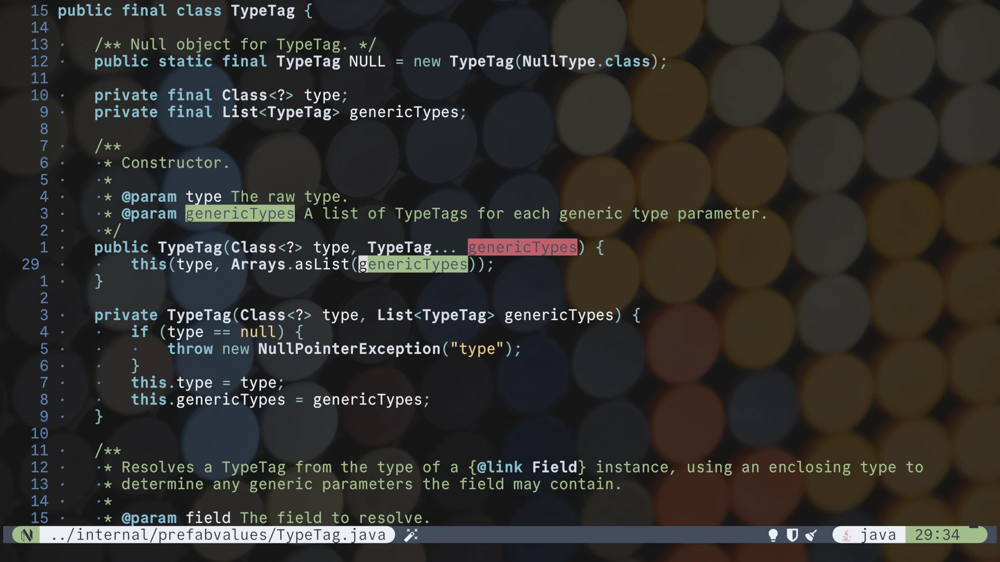

# Tranquility.nvim

A collection of quiet dark colorschemes for Neovim.

## Philosophy

I find that most color schemes emphasize the reserved words in a language by giving them bright colours. Tranquility.nvim does the opposite, and emphasizes identifiers instead. After all, that’s what the code is really about, right?

It provides a collection of colorschemes derived from different well-known palettes, because sometimes it's nice to mix things up, without sacrificing any principles.

## Screenshot


Tranquility: based on [Selenized Dark palette](https://github.com/jan-warchol/selenized)


Tranquil Nord: based on [Nord palette](https://www.nordtheme.com/)


Tranquil Catppuccin: based on [Catppuccin Mocha palette](https://github.com/catppuccin/catppuccin)


Tranquil IntelliJ: based on [IntelliJ palette](https://www.jetbrains.com/idea/)

## Configuration

Install the plugin with your favorite plugin manager, for instance with Lazy:

```lua
return {
    'jqno/tranquility.nvim',

    config = function()
        vim.cmd.colorscheme('tranquility')

        -- Or pick another scheme:
        -- vim.cmd.colorscheme('tranquil-nord')
        -- vim.cmd.colorscheme('tranquil-catppuccin')
        -- vim.cmd.colorscheme('tranquil-intellij')

        -- Or let Neovim pick one at random:
        -- vim.cmd.colorscheme('tranquil-random')
    end
}
```
